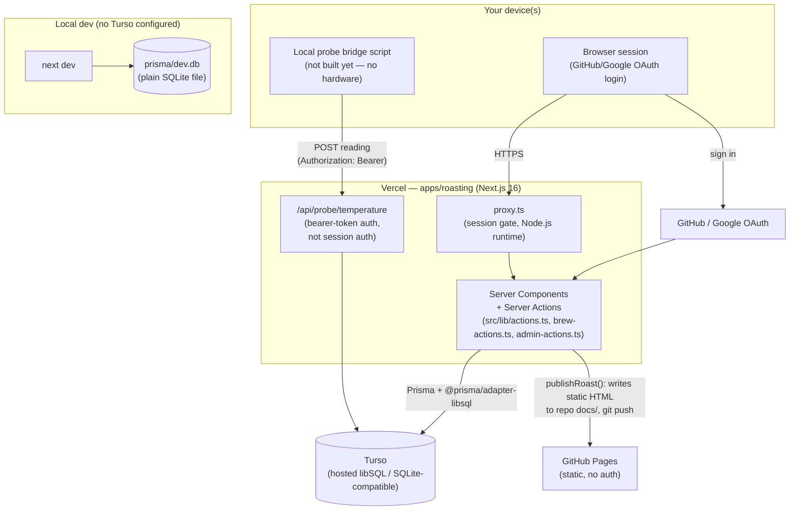
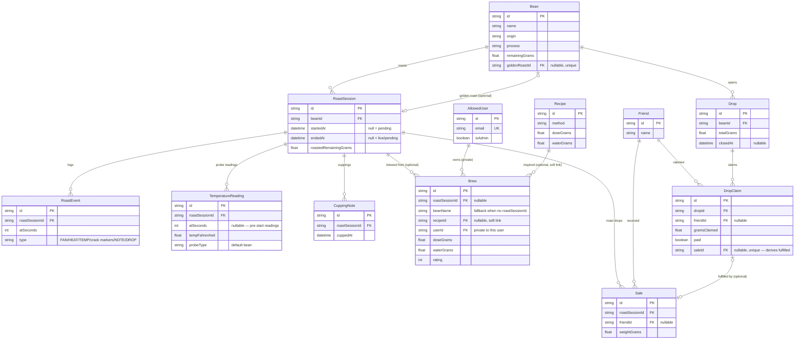

# Architecture

Visual reference for how this app is put together. For *what* each feature
does, see [`README.md`](../README.md); for field-by-field schema detail and
every API/Server Action signature, see [`SCHEMA.md`](SCHEMA.md) and
[`API.md`](API.md); for the *why* behind specific design decisions, see
[`AGENTS.md`](../../AGENTS.md) — this doc doesn't repeat that reasoning, it
just points at it. Diagrams here are hand-maintained, not generated — if
the schema or deployment shape changes, update this file in the same PR,
the same way you'd update a doc comment next to code it describes.

## System overview

Notes on what this diagram is saying:

- **One Next.js app, two data paths.** `src/lib/prisma.ts` picks the Turso
  adapter when `TURSO_DATABASE_URL`/`TURSO_AUTH_TOKEN` are set, otherwise
  falls back to a local SQLite file — the same Prisma schema and code path
  either way (libSQL is wire-compatible with SQLite). Cloning the repo with
  no Turso credentials still works against a local `dev.db`.
- **Two different auth mechanisms, deliberately not shared.** Human traffic
  is session-cookie auth via Auth.js (`proxy.ts` gates every page except
  `/api/auth/*`). The probe-ingest endpoint is bearer-token auth instead —
  it's a machine client with no browser session, and `proxy.ts`'s matcher
  explicitly excludes `/api/probe/*` so the two never collide. See
  AGENTS.md's "Temperature probe" section for the full reasoning.
- **The GitHub Pages export is a one-way, static side door**, not a live
  view of the app — `publishRoast` renders a specific completed roast to
  static HTML and commits it to the repo's `docs/` directory (root of the
  monorepo, not `apps/roasting/docs/` — don't confuse this generated
  directory with *this* hand-maintained one). No auth, no live data; it's a
  snapshot at publish time.

## Data model

Two things this diagram can't show well in Mermaid's ER notation, worth
calling out explicitly:

- **`Bean.goldenRoastId` → `RoastSession`** is a same-direction-twice
  relation: a `Bean` also owns many `RoastSession`s the normal way
  (`roastSessions`). Prisma needs a named relation (`"BeanGoldenRoast"`) to
  tell the two apart — see the schema comment on `Bean.goldenRoastId`.
- **"Fulfilled" isn't a stored field anywhere.** `DropClaim.saleId` being
  non-null *is* "fulfilled" — there's no separate boolean that could drift
  out of sync with it. Same shape for `TemperatureReading`-derived "probe
  connected" state: derived from data, not cached in a flag. This is a
  repeated pattern in this schema, not a one-off — see AGENTS.md's "Drops"
  and "Temperature probe" sections for the two concrete cases and why.

## Where the real reasoning lives

This doc is structural — *what* connects to *what*. The *why* behind each
of these lives in `AGENTS.md`, organized by feature:

| Decision | AGENTS.md section |
|---|---|
| Turso + Vercel over other hosting, and why the free tier is safe to rely on | "Multi-device / sharing with a friend" |
| Real per-user OAuth + DB-backed allowlist instead of a shared password or full multi-tenant orgs | "Multi-device / sharing with a friend" |
| `Sale` (roast drops) and `Drop`/`DropClaim` (group buys) as two deliberately separate systems | "Drops" |
| Fulfillment as a derived state (`saleId != null`), not a checkbox | "Drops" |
| Why temperature readings aren't `RoastEvent`s, and why a local bridge script instead of the Web Serial API | "Temperature probe" |
| Why `Brew` is per-user when everything else in this schema is shared | "Brewing" |
| Why a `Brew` can point at real tracked stock *or* just a free-text bean name | "Brewing" |
| No LLM calls anywhere in the live-tips/comparison logic | "Active app: `apps/roasting`" → "Live tips" (and inline comments in `src/lib/tips.ts`) |
